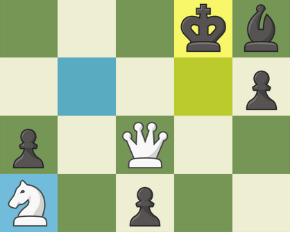

# Chess Bot

A bot (more like a hack) for chess.com. 
Highlight best move squares using stockfish engine.

Only works in online matches. 
Dont play "serious" games with bot, its _**pathetic**_.

`If you use this bot, you will still be terrible at chess...`

I have **NO** plans to make this bot 100% undetectable!

Use at **your own** risk!

## **Install**

### Firefox

- [Download](https://github.com/vanflux/chess-bot/releases/download/chess-bot-pre/chess-bot.zip) the bot (.zip file).
- Go to [about:debugging](about:debugging)
- Click on 'load temporary extension'
- Load the chess-bot.zip file

### Chrome, Opera, IE...

- No, use firefox.
