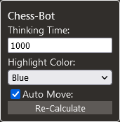

# Chess Bot

A bot (more like a hack) for chess.com. 
Highlight best move squares using stockfish engine.

Only works in online matches. 
Dont play "serious" games with bot, its _**pathetic**_.

`If you use this bot, you will still be terrible at chess...`

I have **NO** plans to make this bot 100% undetectable!

Use at **your own** risk!

Menu of the bot:

---

## How to RUN the `RELEASE` extension

### Firefox

- [Download](https://github.com/vanflux/chess-bot/releases/download/v0.0.2/chess-bot.zip) the bot (.zip file).
- Go to [about:debugging](about:debugging)
- Click on 'load temporary extension'
- Load the chess-bot.zip file

### Chrome, Opera, IE...

- No! use firefox. for now...

---

## How to BUILD?

Install deps using `npm install` 
Run the "build" script `npm run build` (i know its not a REAL build, it watches file changes...)

## Running BUILDED extension

- Go to [about:debugging](about:debugging).
- Click on 'load temporary extension'.
- Go to the `dist` dir (inside the project) and double-click some file.
- Go to [chess.com](chess.com) and play an online match.

---

`Why are you using WEBPACK? TYPESCRIPT?? REACT??!? for this simple thing` 
Answer: I'm learning these things :(
